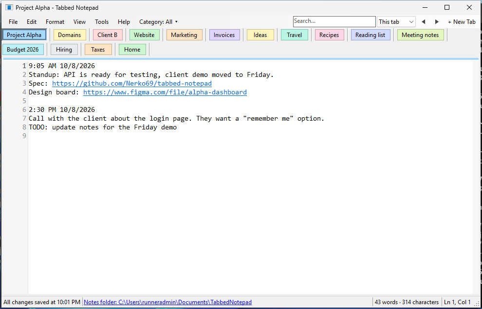

# Tabbed Notepad

A simple Windows notepad with **named, colored tabs**: one tab per project, so you never have to
scroll through one long file to find the right place to write.

Everything is **saved automatically** as you type. There is no "Save" prompt, and your tabs,
their names, colors and text are all back when you open the app again.



**→ [User guide with screenshots](docs/user-guide.md)**

## Download and run

1. Download [`download/TabbedNotepad.exe`](download/TabbedNotepad.exe)
   (on GitHub, open the file and click the **Download raw file** button).
2. Put it anywhere you like, e.g. your Desktop or `C:\Tools`, and double-click it.

No installation needed. It runs on Windows 10 and 11, which already include .NET Framework 4.8.

> Windows SmartScreen may say *"Windows protected your PC"* the first time because the
> .exe is not code-signed. Click **More info → Run anyway**.
> Tip: right-click the .exe → **Pin to taskbar** or **Pin to Start**.

## Features

- **Tabs:** name, color, drag or ◄ ► to reorder. Tabs wrap onto more rows when there are many.
- **Categories** (CC247, OrgSys, WP Plugin, …): show only one category's tabs. Right-click a tab
  to copy its file path. New tabs start with their date/time and file path.
- **Search** (Ctrl+F pops up a search box): every match is highlighted, and each tab shows how
  many matches it has in a small circle. Marks beside the scroll bar show where they are. The
  **Find** dialog adds *Match case* and *Select All*.
- **Organize:** line numbers (click one to bookmark the line), date lines (Ctrl+D), colored
  labels like `AVADOMS`, and a **Navigator** panel (F9) to jump between them.
- **Word and character counter** for each tab.
- **All Links** (Ctrl+L): every link you ever wrote, with dates, plus a generated web page.
- **Links:** click to open in your browser. Hover for a copy icon.
- **Undo / Redo** (Ctrl+Z / Ctrl+Y), **F5** for time and date, plain-text paste.
- **Open Text File:** open `.txt` files from anywhere in tabs. They're saved back into their own file.
- **Save All Tabs As / Open Folder:** choose where your notes live.
- **Quick tab switcher** (Ctrl+P): type part of a tab's name and press Enter.
- **Daily backup:** a zip of all notes every day, kept for 30 days (Tools → Backups).

See the **[user guide](docs/user-guide.md)** for details and all keyboard shortcuts.

## Where are my notes?

The bottom of the window always shows the **notes folder**. Click it to open the folder in
Explorer. By default it is `Documents\TabbedNotepad`.

- Each tab is a plain `.txt` file named after the tab (`Project A.txt`, `Client B.txt`, …), so
  your notes are readable with any editor even without this app. Renaming a tab renames its file.
- `tabs.ini` remembers the tab order, tab colors, bookmarks, labels, files opened from elsewhere,
  the window position and the font.
- `links.tsv` is the list of every link written in your notes (Tools → All Links).
- Closing a tab never deletes its text: it is moved to the `Closed tabs` subfolder.
- **File → Save All Tabs As…** saves every tab into a folder you pick and keeps saving there. The
  old folder stays as a backup. **File → Open Folder…** switches to another notes folder.

Backups are made automatically once a day in the `Backups` subfolder (or a folder you choose). You
can also copy the notes folder yourself. Only one copy of the app runs at a time;
starting it again brings the open window to the front.

## About

Tabbed Notepad application by **WebProgress.AI**: idea and product design by WebProgress.AI.
See **Help → About** in the app, or the file's Properties → Details in Windows Explorer.

## Building from source

The project is a small C# WinForms app in [`src/`](src) targeting .NET Framework 4.8.

```
dotnet build src/TabbedNotepad.csproj -c Release
```

The .exe ends up in `src/bin/Release/net48/`. The GitHub Actions workflow in
`.github/workflows/build.yml` builds it on Windows for every push. It then runs
[`tools/Screenshots`](tools/Screenshots), which opens the app with demo notes, checks the main
features and takes the screenshots in `docs/images/`. The .exe and the screenshots are attached to
each run as downloadable artifacts.
