# Tabbed Notepad – User Guide

Tabbed Notepad is a simple notepad with **named, colored tabs**: one tab per project, so you
never have to scroll through one long file to find the right place to write. Everything you type
is **saved automatically**.

- [Getting started](#getting-started)
- [Tabs](#tabs)
- [Writing](#writing)
- [Organizing your notes](#organizing-your-notes): line numbers, bookmarks, date lines, labels, navigator
- [Searching](#searching)
- [All links](#all-links)
- [Files and folders](#files-and-folders)
- [Keyboard shortcuts](#keyboard-shortcuts)

## Getting started

Download [`TabbedNotepad.exe`](../download/TabbedNotepad.exe) and double-click it. Nothing to
install; it runs on Windows 10 and 11.

> The first time, Windows SmartScreen may say *"Windows protected your PC"* because the app isn't
> code-signed. Click **More info → Run anyway**.


Across the top, from left to right:

- **Menus:** File, Edit, Format and Help.
- **Search box:** search this tab or all tabs.
- **◄ ►:** move the current tab left or right.
- **+ New Tab:** add a tab.

At the bottom, the **status bar** shows:

- when your notes were last saved
- **where they are saved** (click it to open that folder)
- the **number of words and characters** in the tab (or in the selected text)
- the line and column of the cursor

## Tabs

| To… | Do this |
|---|---|
| Add a tab | Click **+ New Tab** or press **Ctrl+T**, then type a name (e.g. a project name) |
| Rename a tab | Double-click it, or press **F2** |
| Switch tabs | Click a tab, **Ctrl+Tab** / **Ctrl+Shift+Tab**, or **Ctrl+1 … Ctrl+9** |
| Go to a tab by name | **Ctrl+P**, type part of its name, Enter (see below) |
| Move a tab | Drag it, or use the **◄ ►** buttons (**Ctrl+Shift+Page Up / Page Down**) |
| Change a tab's color | Right-click the tab → **Tab Color** |
| Put a tab in a category | Right-click the tab → **Category** (or choose one when you create the tab) |
| Copy the path of a tab's file | Right-click the tab → **Copy File Path** (**Show in Folder** opens it in Explorer) |
| Close a tab | **Ctrl+W**, middle-click the tab, or right-click → **Close Tab** |

**Colors.** Every new tab gets a random color, different from the tabs next to it. To change it,
right-click the tab → **Tab Color**. Pick a color, **Random Color**, or **Custom Color…** for any
color you like. The same menu is under **Format → Tab Color**.

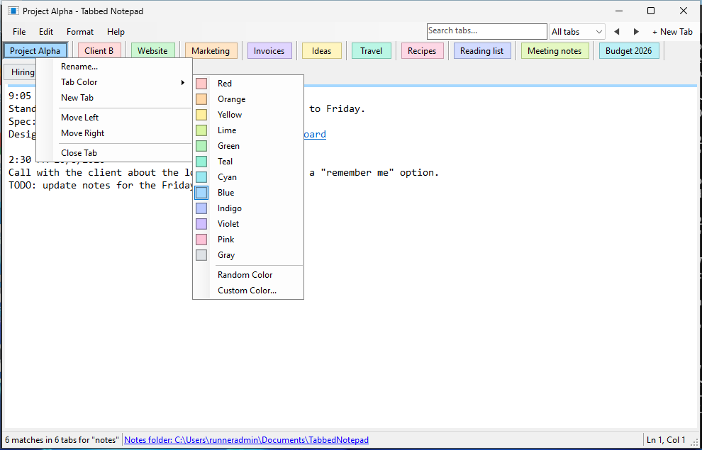

**Quick tab switcher (Ctrl+P).** Press **Ctrl+P** (or **View → Go to Tab…**) and type part of a
tab's name or its category. The best matches come first: `cli` finds *Client B*, and letters in order
work too (`prjal` finds *Project Alpha*). Use **↑ ↓** to choose and **Enter** to go there; it also
finds tabs hidden by the Category filter. With nothing typed, the list starts with your most recently
used tabs, so **Ctrl+P, Enter** jumps back to the previous tab.

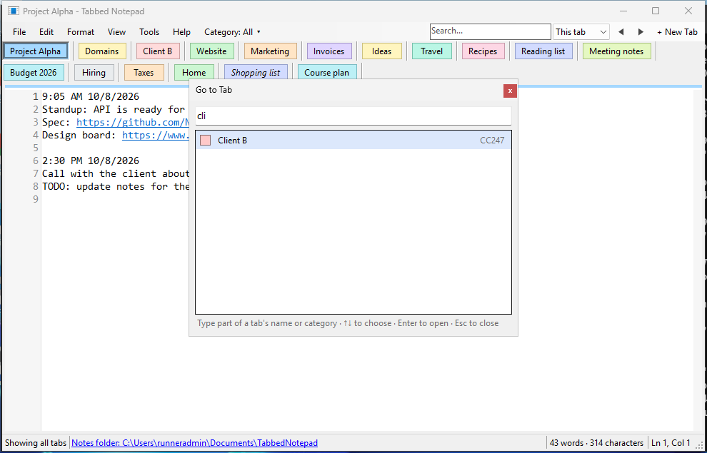

**Categories.** Group your tabs into categories such as CC247, OrgSys, WP Plugin, GHL, Windows,
Linux, Mobile App or Course. Use the **Category** menu on the menu bar to **show only the tabs of
one category**. The other tabs stay open and keep saving; choose **All tabs** to see them again.

- Choose a category when you create a tab, or right-click a tab → **Category**.
- A new tab gets the category you're viewing.
- **Manage Categories…** (in the Category menu, or **Tools → Tab Categories…**) adds, renames,
  removes and reorders categories.
- A tab's category shows in its tooltip.

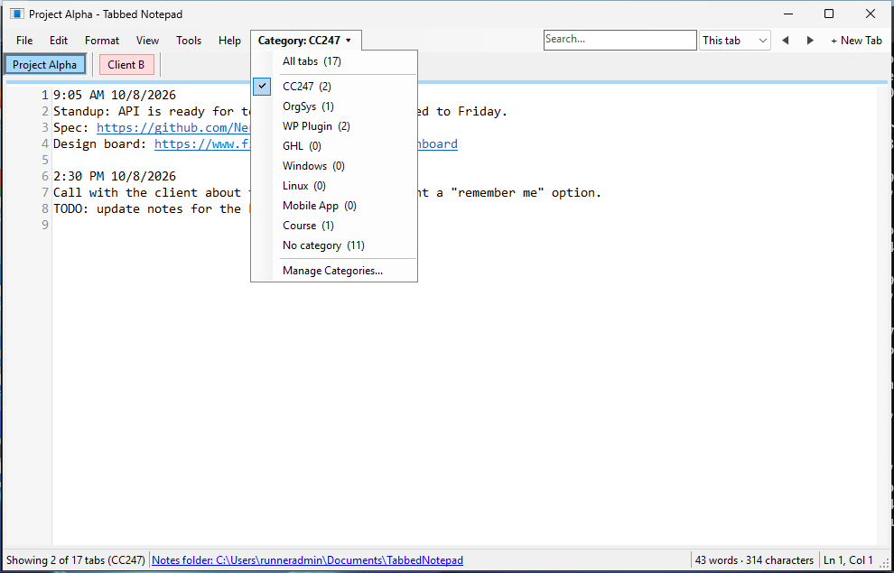

**New tabs** start with the date and time they were created and the full path of their file:

```
Date/Time	4:49 PM 10/10/2026
Path		C:\Users\me\Documents\TabbedNotepad\NewTabName.txt
```

If you rename the tab, or move your notes with *Save All Tabs As*, the Path line is updated.

**Rows.** When there are more tabs than fit across the window, they wrap onto more rows, so every
tab stays visible. If you prefer a single row, turn off **View → Tabs in Multiple Rows**. The
row then scrolls with the small arrows at its right end.

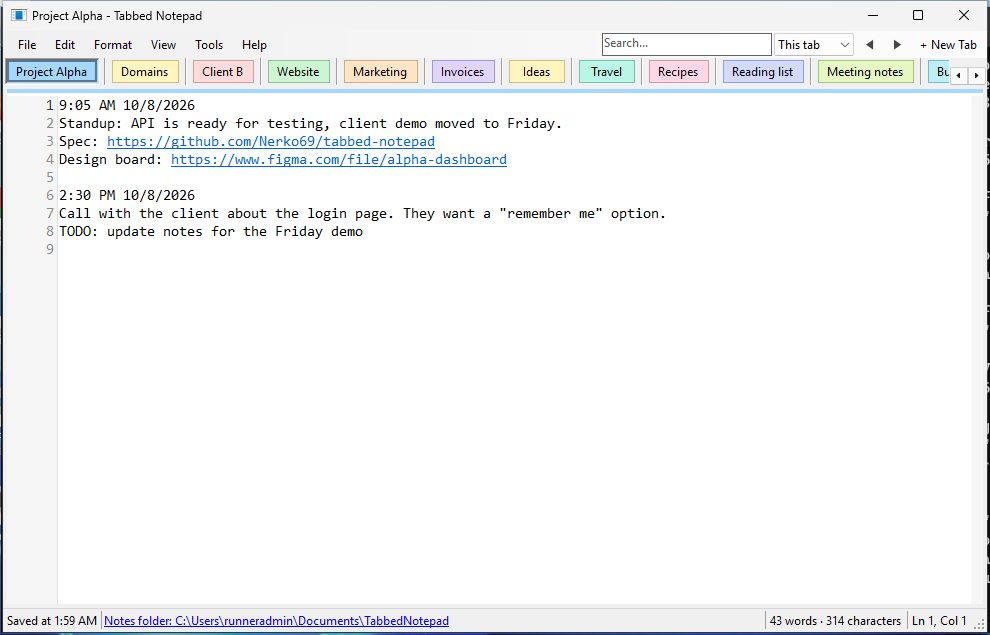

**Closing a tab never deletes your text.** It is moved to the `Closed tabs` folder inside your
notes folder, so you can get it back.

## Writing

- **Saving is automatic.** A moment after you stop typing, the tab is saved. **Ctrl+S** saves
  immediately if you want to be sure.
- **F5** inserts the current time and date, handy for a daily log.
- **Undo / Redo:** **Ctrl+Z** and **Ctrl+Y**, as many steps back as you need.
- **Pasting** always pastes plain text, so text copied from a web page or Word doesn't bring its
  fonts and colors along.
- **Links** (`https://…`, `www.…`) are underlined. **Click** one to open it in your web browser.
  **Hover** over one and a small **copy icon** appears at its end: click it to copy the link,
  without having to select it. You can also right-click a link → **Copy Link**.

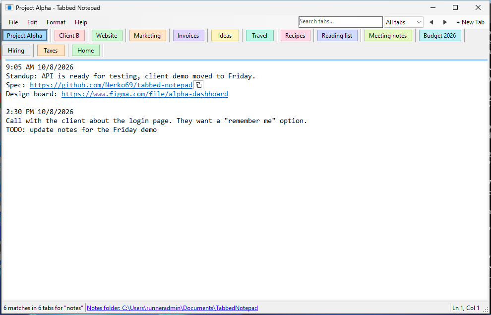

## Organizing your notes

These tools help you find your way around long notes, such as a daily log of domain research.

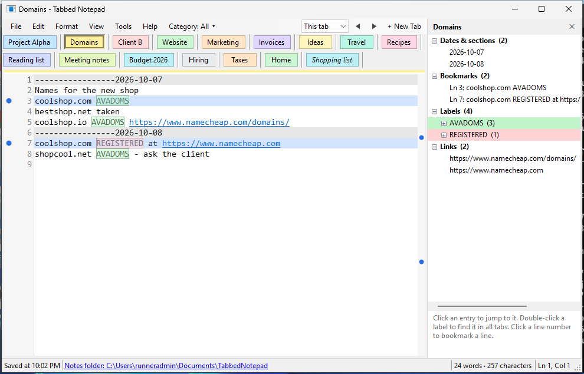

**Line numbers and bookmarks.** Line numbers run down the left side (turn them off with **View →
Line Numbers**).

- **Click a line number** to bookmark that line. It gets a blue dot and a light-blue band, and it
  stays bookmarked the next time you open the app. Click again to remove the bookmark.
- **Ctrl+F2** bookmarks the line the cursor is on.
- **F8** / **Shift+F8** jump to the next / previous bookmark.
- Bookmarks stay on their line while you add or delete text above it.

**Date lines.** A line with a run of at least five `-`, `=`, `_`, `*`, `~` or `#` characters,
such as `-----------------2026-10-08`, is treated as a section divider. It is shaded gray and
listed in the Navigator, so you can jump to any day. **Ctrl+D** inserts one with today's date:
`------------------------------2026-10-10`.

**Labels.** Labels are words you use to mark your notes, like `AVADOMS` (available domains) or
`REGISTERED`.

- Add them in **Tools → Labels…**, or select a word in a note and use **Tools → Make Selected
  Word a Label**.
- Each label has its own color and is highlighted wherever you type it. It matches whole words
  with the exact capitalisation: `AVADOMS`, not `avadoms`.
- In the Labels window, **Insert in Note** (or a double-click) types the label at the cursor.

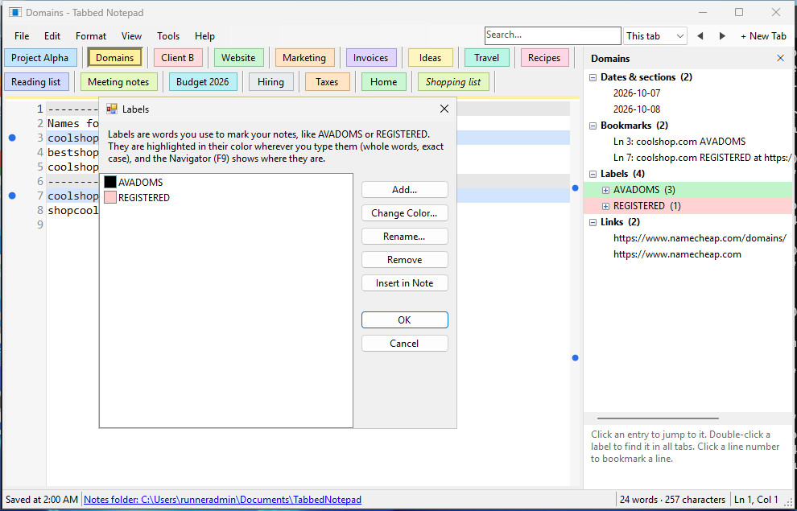

**Navigator (F9).** A side panel listing the current tab's **dates & sections**, **bookmarks**,
**labels** (with where each one is used) and **links**. Click any entry to jump to it.
Double-click a label to find it in **all** tabs: the tabs that contain it show a count.

**Tip, a simple marking system:**

- **A date line for each day** (Ctrl+D), so the Navigator becomes a list of days.
- **A label for each kind of thing you track:** `AVADOMS` for domains you found, `REGISTERED`
  once you buy one, `TODO`, `IDEA`, `CALL`.
- **A bookmark** on anything you'll want to come back to soon.

## Searching

**Ctrl+F** opens the **pop-up search box** at the top right of the note, like in a web browser.
The same search is also always available in the box on the menu bar. If you prefer that box,
turn off **View → Ctrl+F Opens Pop-up Search**.

1. Type what you are looking for. Every match is highlighted in light yellow, so the text stays
   readable.
2. **Every tab that contains it shows the number of matches in an orange circle**, so you can see
   at a glance which tabs mention it.
3. Next to the scroll bar, **orange marks** show where the matches are in the whole note (blue dots
   are bookmarks). Click a mark to jump there.
4. **Enter** jumps to the next match (*2 of 7*), **Shift+Enter** to the previous one, or use **▲ ▼**.
5. **This tab / All tabs** chooses whether Enter goes through the current tab only (the default) or
   through every tab.
6. **Esc** or **×** clears the search.

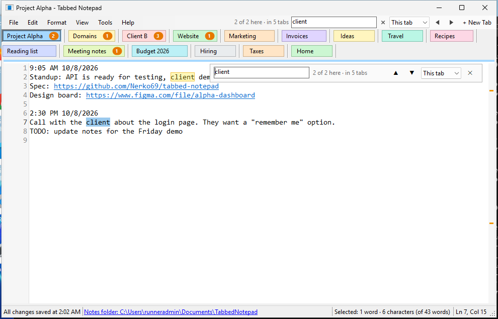

**The Find dialog** (**Edit → Find…** or **Ctrl+Shift+F**) adds **Match case**. It also has
**Select All**, which highlights every match and shows how many there are, in this tab or in all
tabs. **F3** / **Shift+F3** find the next / previous match.

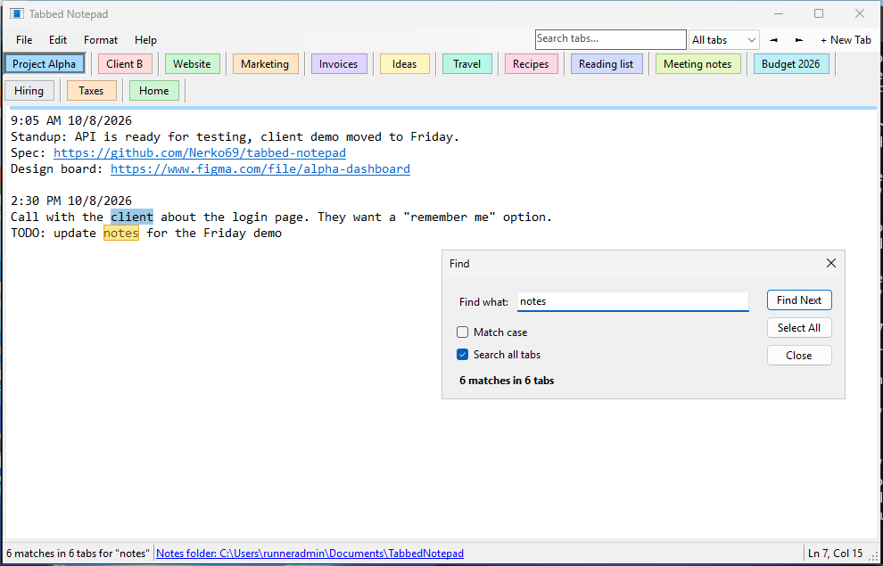

## All links

Every web link you write in your notes is remembered, with the date it was first and last seen,
the tab it is in and the line around it. It stays remembered even after you delete it from a note.

**Tools → All Links…** (**Ctrl+L**) shows them all:

- **Filter** to search the list.
- Double-click a link (or **Open Link**) to open it.
- **Copy Link** copies it.
- **Show in Note** jumps to where it is written.
- **Open as Web Page** creates `links.html` in your notes folder, with all links grouped by tab,
  and opens it in your browser.

Links that are no longer in any note are shown in grey. The list itself is kept in `links.tsv` in
your notes folder (it opens in Excel too).

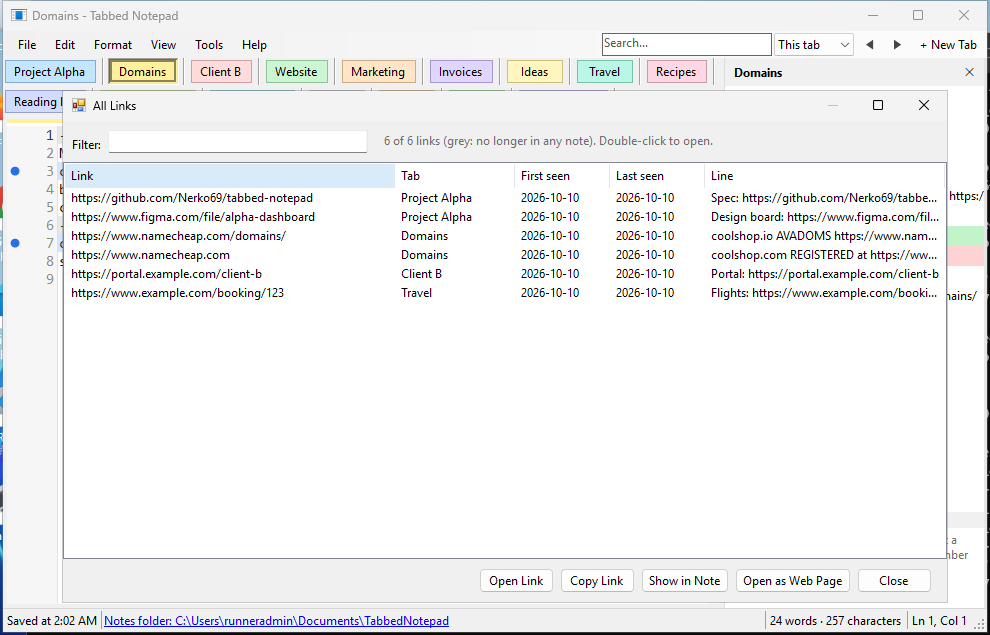

## Files and folders

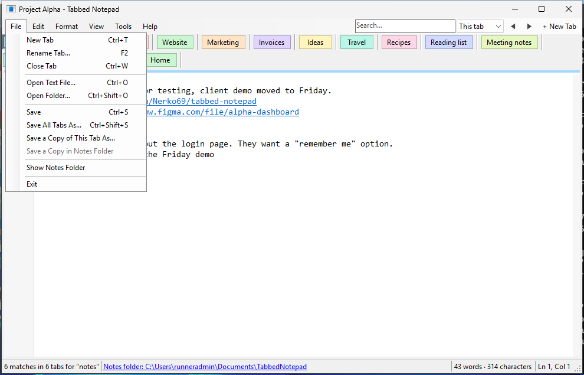

**Where are my notes?** Each tab is saved as a normal `.txt` file named after the tab
(`Project Alpha.txt`, …) in your **notes folder**: `Documents\TabbedNotepad`, unless you choose
another one. The status bar always shows it, and **File → Show Notes Folder** opens it. You can
read your notes with any editor, even without this app. To back them up, copy that folder.

| Menu item | What it does |
|---|---|
| **Open Text File…** (Ctrl+O) | Opens one or more `.txt` files from anywhere. Each opens in a new tab, or in the current tab if that one is empty. |
| **Open Folder…** (Ctrl+Shift+O) | Switches to the notes in another folder. You can also open a folder of ordinary `.txt` files: each file becomes a tab. |
| **Save** (Ctrl+S) | Saves everything now (it's automatic anyway). |
| **Save All Tabs As…** (Ctrl+Shift+S) | Like *Save As*, but for all tabs: pick a folder, and all tabs are saved there and keep being saved there. The old folder is left as a backup. |
| **Save a Copy of This Tab As…** | Saves a copy of the current tab as a `.txt` file wherever you like. |
| **Save a Copy in Notes Folder** | For a tab opened with *Open Text File*: adds a copy of it as a normal tab in your notes folder. |

**Text files opened with Open Text File** stay where they are. Their tab is shown in *italics*,
the status bar shows the file's location, and your changes are saved back into that same file,
in the format it had. If another program changes the file while it's open, you are asked which
version to keep.

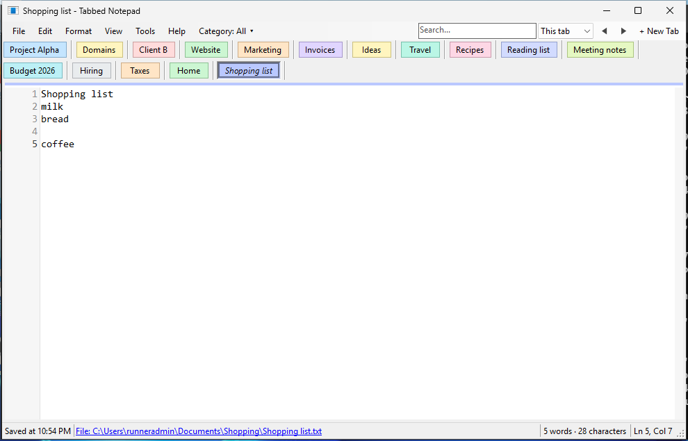

## Backups

Once a day, Tabbed Notepad saves a **zip backup of all your notes** in the `Backups` folder inside
your notes folder, named like `TabbedNotepad-2026-10-10.zip`. Backups older than 30 days are deleted.
The zip contains every tab's `.txt` file, `tabs.ini`, the links list, the `Closed tabs` folder, and
any text files you opened from elsewhere (under `Other files`). It runs in the background and
doesn't interrupt your typing; if the app stays open past midnight, the next day's backup is made too.

**Tools → Backups** has:

- **Back Up Now:** an extra backup right away (named with the time, e.g. `TabbedNotepad-2026-10-10-1530.zip`).
- **Open Backups Folder.**
- **Daily Backup:** turn the daily backup on or off.
- **Choose Backup Folder…:** a backup on the same disk doesn't help if the disk fails, so choosing a
  folder in OneDrive, on another drive or on a USB stick is safer.
- The date and time of the last backup.

To get a note back, open the zip in Explorer and copy the `.txt` file you need.

## Keyboard shortcuts

| Keys | Action |
|---|---|
| Ctrl+T | New tab |
| F2 | Rename tab |
| Ctrl+W | Close tab |
| Ctrl+Tab / Ctrl+Shift+Tab | Next / previous tab |
| Ctrl+1 … Ctrl+9 | Go to tab 1 … 9 (Ctrl+9: last tab) |
| Ctrl+Shift+Page Up / Page Down | Move tab left / right |
| Ctrl+Z / Ctrl+Y | Undo / Redo |
| F5 | Insert time and date |
| Ctrl+D | Insert a date line (`-----…2026-10-10`) |
| Click a line number / Ctrl+F2 | Bookmark a line |
| F8 / Shift+F8 | Next / previous bookmark |
| F9 | Navigator |
| Ctrl+P | Go to a tab by name |
| Ctrl+L | All links |
| Ctrl+F | Search (pop-up box) |
| Ctrl+Shift+F | Find dialog |
| F3 / Shift+F3 | Next / previous match |
| Ctrl+O | Open text file |
| Ctrl+Shift+O | Open folder |
| Ctrl+S | Save |
| Ctrl+Shift+S | Save all tabs as… |
| F1 | This guide |
